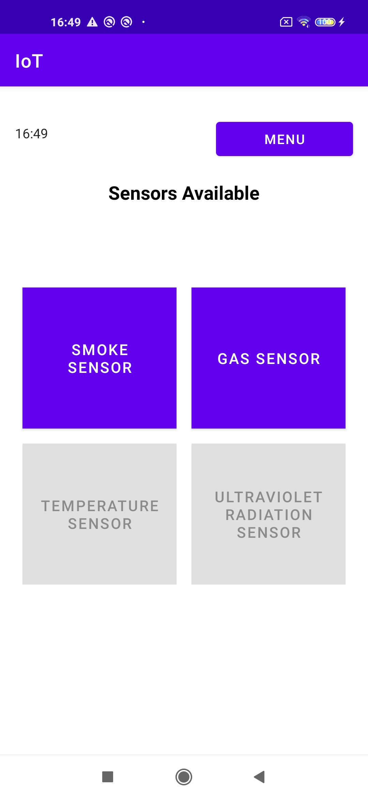
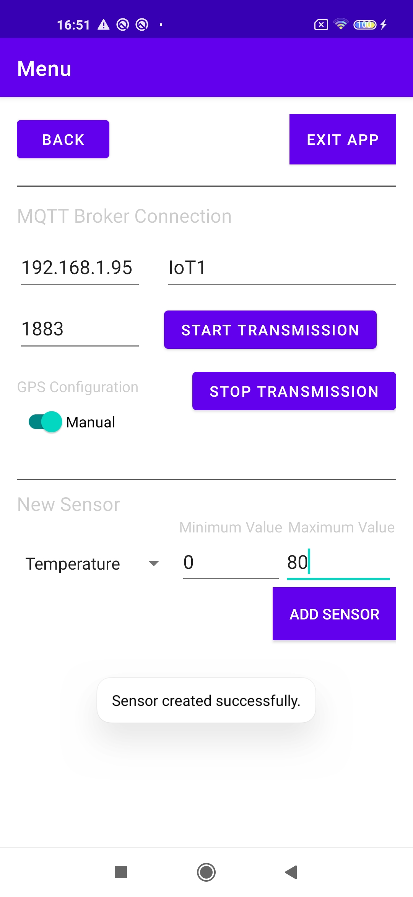
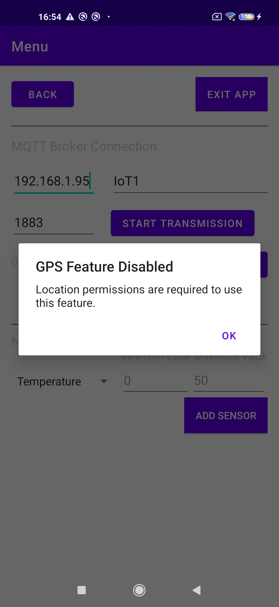
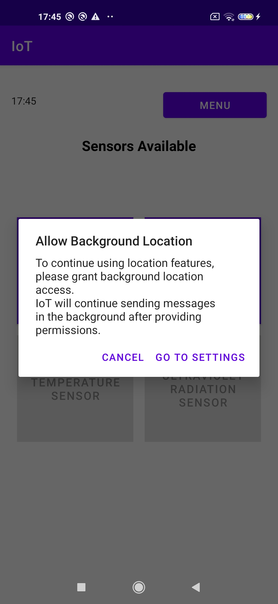
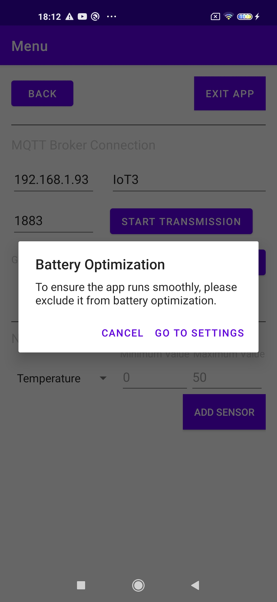
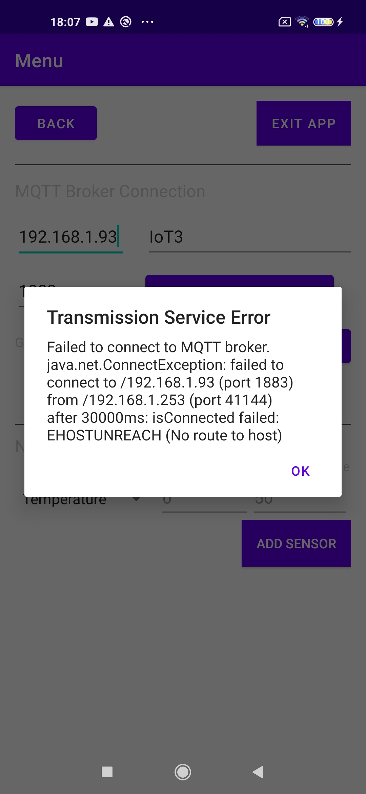

# Λειτουργικότητα της android Εφαρμογής ΙοΤ
*Η IoT-App είναι μια Android εφαρμογή υλοποιημένη σε Java μέσω Gradle και Android Studio*

Η διεπαφή της εφαρμογής που προσομοιάζει τα ΙοΤ απαρτίζεται απο 3 βασικά activities: 
- τη MainActivity που οδηγεί στις επόμενες 2, 
- τη MenuActivity όπου ο χρήστης μπορεί να αλλάξει τις ρυθμίσεις ή να φύγει απ' την εφαρμογή 
- και τη SensorActivity όπου προβάλλονται και ελέγχονται οι τιμές των διαθέσιμων αισθητήρων.

<u>Υπόθεση</u> : Θεωρήσαμε ότι δε θα υπήρχαν πολλαπλοί αισθητήρες του ίδιου τύπου.

## Ζητούμενες Άδειες
1. Coarse grained location
2. Fine grained location
3. Background location 
4. Εξαίρεσης από βελτιστοποίηση χρήσης μπαταρίας (προαιρετικό για λόγους αξιόπιστης απόδοσης)

## BaseActivity
Βασικό Activity που κάνουν extend όλα τα υπόλοιπα. Παρέχει χρήσιμη λειτουργικότητα για ανίχνευση λαθών που σταματούν την αποστολή δεδομένων (TransmissionService), και την προβολή παραθύρων διαλόγου για αυτά.
Για την ανίχνευση των λαθών χρησιμοποιείται broadcast receiver.

## MainActivity
Το πρώτο Activity της εφαρμογής. Διαθέτει κουμπιά που οδηγούν στην οθόνη (Fragment) κάθε αισθητήρα του SensorActivity αλλά διατηρεί clickable μόνο αυτά για τα οποία υπάρχει αισθητήρας. Θα εξηγηθεί περισσότερο στην συνέχεια.
Επιπλέον, έχει ένα κουμπί που οδηγεί στη MenuActivity.

Παραπάνω βλέπουμε την αρχική κατάσταση της εφαρμογής, με μοναδικούς αισθητήρες να είναι οι default.

## MainActivity
### Διεπαφή: Γενικά
Όπως ζητήθηκε, το μενού της εφαρμογής δίνει τα κατάλληλα πεδία για επιλογή ή αλλαγή της διεύθυνσης του MQTT Broker, αλλά και για τη δημιουργία νέων αισθητήρων. Επιπλέον, προστέθηκε κουμπί με το οποίο ο χρήστης ξεκινάει 
ρητά τη διαδικασία αποστολής δεδομένων προς τον Broker, διότι εναλλακτικές επιλογές όπως αυτόματη εκκίνηση της όποτε αλλάζει το κείμενο στο κενό του ServerIP ή του ServerPort θα προκαλούσε πολλές αχρείαστες επανασυνδέσεις.

### Δημιουργία Νέου Αισθητήρα
Όσον αφορά στη δημιουργία νέων αισθητήρων, οι πιθανοί τους τύποι δίνονται ως ένα κλειστό drop down list, και ως προς τα κενά σχετικά με τις ελάχιστες και μέγιστες τιμές του μετρητή, για αποφυγή απρόβλεπτης/λάθους συμπεριφοράς, λήφθηκαν υπ' όψη τα παρακάτω Failure Cases:
1. Ένας αισθητήρας για να δημιουργηθεί πρέπει να μην υπάρχει ήδη.
2. Επιπλέον, για να είναι καλά ορισμένα τα όρια, η min τιμή πρέπει να είναι μικρότερη απ' τη max.
3. Για να είναι χρήσιμος για τους σκοπούς της εργασίας ο αισθητήρας, πρέπει η max τιμή του να ξεπερνά το κατώφλι του αντίστοιχου τύπου αισθητήρα.
4. Οι ακραίες τιμές του αισθητήρα που δίνει ο χρήστης δεν πρέπει να ξεπερνάνε αυτές που δίνει η εκφώνηση της εργασίας.

Σε περίπτωση που δεν ισχύει κάποια απ' τις παραπάνω προϋποθέσεις, εκτυπώνεται Toast στην οθόνη για το πρώτο failure case που διαπιστώθηκε και ο νέος αισθητήρας δεν καταχωρείται.
Αλλιώς, εμφανίζεται Toast για την επιτυχή δημιουργία νέου αισθητήρα.

    
  

#### Υλοποίηση Λειτουργικότητας
##### SensorAdder
Κλάση υπεύθυνη για τη σωστή δημιουργία νέου αντικειμένου SensorConfig με βάση τις τιμές που δόθηκαν στα αντίστοιχα κενά της MenuActivity. 
- Ελέγχει την τήρηση των προϋποθέσεων για τη δημιουργία του ζητούμενου αισθητήρα. 
- Σε περίπτωση επιτυχίας, φτιάχνει ένα αντικείμενο SensorConfig με τις ζητούμενες ακραίες τιμές και αρχικοποιεί την τωρινή του μέτρηση ως τον μέσο όρο αυτών. Τέλος, δίνει το καινούργιο αντικείμενο στον SensorStateManager ώστε να το προσθέσει. 
- Εκτυπώνει τα Toasts σχετικά με την επιτυχημένη ή αποτυχημένη προσθήκη αισθητήρα. Για αυτό χρειάζεται ως πεδίο το context του MenuActivity.

### Αρχή Επικοινωνίας Μέσω MQTT
**screenshot με μήνυμα/Toast κατόπιν αρχής του TransmissionService**

## SensorActivity
H Activity που επιτρέπει στον χρήστη να δει τους διαθέσιμους αισθητήρες και να αλλάξει τις τιμές τους.
- Κάθε Sensor περιέχει μια σύντομη περιγραφή του αισθητήρα, διακόπτη για την κατάσταση του και τον slider. 
- Ο χρήστης μπορεί να αλλάζει μεταξύ των διαφορετικών αισθητήρων μέσω swipes. H σειρά με την οποία προβάλλονται είναι προκαθορισμένη με βάση την σειρά εμφάνισης των αισθητήρων στο SensorTypes enumeration: Καπνού, Αερίου, Θερμοκρασίας, Υπεριώδους ακτινοβολίας. 

### Υλοποίηση Λειτουργικότητας
#### SensorFragment
Fragment το οποίο δημιουργείται συναρτήσει του τύπου αισθητήρα που αυτό προσομοιάζει. Με βάση αυτό, ένα νέο instance ενός SensorFragment:
- Αποκτά τους κατάλληλους τίτλους/περιγραφές.
- Αναζητά το SensorConfig αντικείμενο που αναπαριστά (με τη βοήθεια του SensorStateManager). Έτσι δίνει κατάλληλες αρχικές καταστάσεις στην τιμή του slider και το switch για την κατάσταση του αισθητήρα (Ενεργός/Ανενεργός)
#### Swipe-able Διεπαφή
H SensorActivity δημιουργείται με Intent που έχει ως extra το SensorType. Αυτό επιτυγχάνεται από μεριάς του MenuActivity (που δημιουργεί το intent) αναγνωρίζοντας ποιο κουμπί αισθητήρα πατήθηκε. Στη συνέχεια, η SensorActivity: 
- Φτιάχνει ένα TabLayout το οποίο γεμίζει έμμεσα με Tabs (Fragments).
- Τα ίδια τα Tabs και το πλήθος τους ελέγχονται από τον SensorAdapter, έναν FragmentStateAdapter που με βάση τη λίστα των υπαρχόντων αισθητήρων:
  * Καθορίζεται το απαιτούμενο πλήθος από Fragments
  * Καθένα από αυτά θα είναι ίδιου τύπου με το αντίστοιχο αντικείμενο της λίστας από SensorConfigs.
- O SensorAdapter προστίθεται σε έναν ViewPager2, o οποίος είναι υπεύθυνος για τη δημιουργία και αλλαγή μεταξύ των διαφορετικών Fragments, με βάση των 'κανόνων' του Adapter.

## Δομή και Διαχείριση των Αισθητήρων
Για τη διαχείριση των αισθητήρων, δεδομένου ότι ο χρήστης αποφασίζει πολλά πράγματα γύρω απ' αυτούς και πρέπει να διατηρούνται συνεπή, δημιουργήθηκαν οι παρακάτω κλάσεις, στο πακέτο sensor:
### sensor.SensorType
Ένα enumeration που επιπλέον συνδέει τον τύπο ενός αισθητήρα με τις προδιαγραφές του για τις ακραίες του τιμές όπως και το κατώφλι επικινδυνότητας του, με χρήση του nested class SensorLimits. Με αυτόν τον τρόπο ήταν πιο ευέλικτοι οι έλεγχοι ορίων σε περιπτώσεις όπως τον έλεγχο των ορίων κατά τη δημιουργία αισθητήρα.
### sensor.SensorConfig
Η αναπαράσταση ενός αισθητήρα εντός της εφαρμογής. Τα δεδομένα του είναι:
- ο τύπος του (SensorType enumeration),
- η κατάσταση του (ενεργός/ανενεργός),
- οι οριακές του τιμές,
- η τωρινή του τιμή.
Η τιμή του όπως και η κατάσταση του αλλάζουν δυναμικά μέσω setters.

### sensor.SensorStateManager
Πολλά activities (όπως και το Service της εφαρμογής) χρειάζονται πρόσβαση στα δεδομένα των αισθητήρων. Ήδη συζητήθηκε ότι η SensorActivity χρειάζεται, για προφανείς λόγους, αλλά κι η MenuActivity για να ελέγξει τη μοναδικότητα του ζητούμενου νέου αισθητήρα. Για να "κοιτάζουν" όλες τους σε μια κοινή κατάσταση, φτιάχτηκε ο SensorStateManager.
* Περιέχει μια λίστα με τα υπάρχοντα SensorConfig αντικείμενα.
* Είναι βάσει σχεδιασμού singleton class, δηλαδή δημιουργείται μόνο μία φορά εσωτερικά, και κάθε κλάση (Activity) που θέλει να τη χρησιμοποιήσει παίρνει *πρόσβαση* σε αυτό το αντικείμενο μέσω της getInstance(), δεν το δημιουργεί.
* Δεδομένου ότι το Instance αυτό είναι κοινόχρηστο, η getInstance() δηλώνεται synchronous ώστε να μην εκτελεστεί ταυτόχρονα από πολλαπλά threads. Αλλά κατά τα άλλα, επειδή ανά πάσα στιγμή το πολύ η SensorActivity επεξεργάζεται τα δεδομένα τους, ενώ η υπόλοιπη εφαρμογή μόνο τα διαβάζει, δε χρειάστηκε περεταίρω συγχρονισμός.
* Οι υπόλοιπες ενέργειες του είναι λειτουργίες πάνω στη λίστα: έλεγχος αν ένας δεδομένος τύπος αισθητήρα έχει δημιουργηθεί, προσθήκη του στη λίστα κ.ο.κ.
* Κατά τη δημιουργία του, βάσει των προδιαγραφών της εφαρμογής, η λίστα αρχικοποιείται με SensorConfigs για αισθητήρες Αερίου και Καπνού. Οι ακραίες τους τιμές είναι by default οι δοσμένες απ' τα SensorType.SensorLimits.
* *ΔΕΝ* υπάρχει η δυνατότητα διαγραφής αισθητήρων απ' τη λίστα, αφού δεν περιγράφεται ως λειτουργικότητα της εφαρμογής στην εκφώνηση.

## Έναρξη Μετάδοσης Δεδομένων 
- Στο MenuActivity, ο χρήστης συμπληρώνει τα στοιχεία του broker, καθώς και τη ρύθμιση GPS που επιθυμεί, και πατάει το κουμπί για την έναρξη της μετάδοσης δεδομένων
- Για λόγους ορθότητας, τα περιεχόμενα το πεδίο του IP ελέγχονται ως προς τη γενική τους δομή ώστε να αντιστοιχεί σε γενική μορφή IPv4, με χρήση της κλάσης IPValidator. Για το port δε χρειάστηκε να γίνει το ίδιο, αφού στο menu-activity.xml δηλώνεται πως το κενό συμπληρώνεται αποκλειστικά με νούμερα. Σε περίπτωση λάθους ή μη συμπλήρωσης των κενών εμφανίζεται παράθυρο διαλόγου για αυτό.
- Σε περίπτωση επιτυχίας ο χρήστης ενημερώνεται μέσω Toast ότι η μετάδοση ξεκίνησε.

  
  
- Αν επιθυμεί να αλλάξει οτιδήποτε απ' τα παραπάνω, θα πρέπει αμέσως μετά να ξαναπατήσει το κουμπί για έναρξη του service.
### Αλλαγή GPS Configuration - Παροχή Αδειών
#### 1. Άδειες Τοποθεσίες στο προσκήνιο:
Πιο συγκεκριμένα για την αλλαγή της ρύθμισης τοποθεσίας, η αλλαγή του διακόπτη για τo GPS Configuration σε Auto πυροδοτεί διάλογο για την παροχή άδειας χρήσης λεπτομερούς (Fine Grained) τοποθεσίας. Κατόπιν αποδοχής, η χρήση τοποθεσίας θα λειτουργήσει φυσιολογικά, αλλιώς θα ζητηθεί η άδεια για χρήση της ευρύτερης (Coarse Grained) τοποθεσίας. Αν και αυτή απορριφθεί θα εμφανιστεί παράθυρο διαλόγου στον χρήστη ότι η ζητούμενη επιλογή δεν μπορεί να λειτουργήσει. Αυτή η συμπεριφορά θα επαναλαμβάνεται κάθε φορά που ο χρήστης επιλέγει ξανά το auto και δεν έχουν παραχωρηθεί οι κατάλληλες άδειες.

Αλλιώς, πατώντας ξανά το κουμπί Start Data Transmission, η αλλαγή της επιλογής του αποτυπώνεται στην αποστολή των δεδομένων.
#### Υλοποίηση
Ο Listener που είναι υπεύθυνος για την αλλαγή της κατάστασης του διακόπτη του GPS Configuration, αν δει ότι έγινε η αλλαγή από manual σε auto, και δεν έχουν παραχωρηθεί στην εφαρμογή οι προαναφερθέντες άδειες, κάνει αίτημα για το fine grained location. Η onPermissionResults() που αναπτύξαμε φτιάχτηκε με τέτοιο τρόπο ώστε κατόπιν άρνησης του αιτήματος αυτού να κάνει αίτημα για τo coarse grained location, και εν τέλει αν ο χρήστης αρνηθεί κι αυτό καλεί την συνάρτηση για την εμφάνιση του παραθύρου διαλόγου.  

### 2. Άδεια χρήσης τοποθεσίας στο παρασκήνιο
Ο χρήστης εφόσον χρησιμοποιεί auto GPS και επιχειρήσει να φύγει από την εφαρμογή, βλέπει διάλογο που (βάσει των κανόνων ασφαλείας του Android 11) ζητούν από τον χρήστη να παραχωρήσει την άδεια για μόνιμη χρήση τοποθεσίας, ώστε η μετάδοση να συνεχίσει επιτυχώς στο παρασκήνιο.

## 3. Εξαίρεση απ' τη Βελτιστοποίηση μπαταρίας
Ανα 3 επισκέψεις του στο MenuActivity, ό χρήστης βλέπει διάλογο που του προτείνει να εξαιρέσει την εφαρμογή απ' τη βελτιστοποίηση μπαταρίας.

## Επικοινωνία Μέσω MQTT
### net.TransmissionService
Android service υπεύθυνο γα τη συλλογή και την αποστολή των δεδομένων για την κατάσταση του ΙοΤ μέσω MQTT. 
* Χρησιμοποιεί
- ένα DeviceDataRetriever για τη συλλογή των δεδομένων της ίδιας της συσκευής (μπαταρία, τοποθεσία), 
- το SensorStateManager για τα δεδομένα των αισθητήρων,
- το AndroidMQTTClient για την αποστολή των δεδομένων.
- έναν java.util.concurrent.jobExecutorService για τη διαχείριση των περιοδικών αποστολών δεδομένων.

#### Lifecycle management
Όταν ξεκινάει, ορισμένα πεδία της έχουν ήδη δημιουργηθεί απ' την onCreate(). Λαμβάνει τα κατάλληλα extras για τη λειτουργία της (device ID, location mode, broker URL) και σε περίπτωση επανεκκίνησης "καθαρίζει" προηγούμενες τιμές των αντικειμένων της (θέτει κατάλληλη ρύθμιση τοποθεσίας στον DeviceDataRetriever, αδειάζει την ουρά εργασιών του jobExecutorScheduler, κάνει επανασύνδεση του MQTT client στον broker κ.ο.κ.)

#### Topics και Αποκλειστικότητα μεταξύ των IoTs
Κάθε ΙοΤ αναρτά σε topic ξεχωριστό για εκείνο (καθορίζεται απ' το DeviceID). Για διασφάλιση της αποκλειστικότητας τους, πρωτού το TransmissionService ξεκινήσει τη μετάδοση, κάνει αίτημα "εγγραφής" στον Edge Server της μορφής ("\<clientId\> \<deviceID\>"). Ο σέρβερ θα εγκρίνει τη χρήση του εφόσον διαπιστώσει ότι δεν χρησιμοποιείται ήδη από άλλο ΙοΤ. Αλλιώς αντιμετωπίζεται ως fatal error για το TransmissionService.

#### Χειρισμός Εξαιρέσεων
Ορισμένα fatal errors, όπως η μη μοναδικότητα του DeviceID, τα MQTT Exceptions κατά τη σύνδεση/αποσύνδεση ή η αδυναμία συλλογής της τοποθεσίας λόγω ανεπαρκών αδειών, προκαλούν τερματισμό του Service. Κατόπιν στέλνεται error broadcast που λαμβάνει οποιαδήποτε ενεργό Activity της εφαρμογής:

#### Περιοδική Αποστολή Δεδομένων
Εφόσον η σύνδεση του MQTTClient και η εκχώρηση του topic είναι επιτυχής, ξεκινάει η περιοδική ανάρτηση μηνυμάτων. To jobExecutorService χρονοδρομολογεί περιοδικά Tasks (Runnables) ανά 1 δευτερόλεπτο, τα οποία ανακτούν τις τωρινές πληροφορίες της συσκευής (μπαταρία, τοποθεσία) και της εφαρμογής (καταστάσεις αισθητήρων) και τα στέλνει μέσω MQTT. 

<b>Δομή Μηνύματος:</b>
Η δομή του μηνύματος που αποστέλλεται από το ΙοΤ προς τον EdgeServer είναι της μορφής "\<Label1 Data1\> \<Label2 Data2\> …", όπου:
* Label: ο τύπος του αισθητήρα (Smoke, Gas, Temperature, UV), ή για το τμήμα του μηνύματος που αφορά πληροφορίες για το ΙοΤ Battery, Longitude, Latitude.
* Data: μια float τιμή που αναπαριστά το αντίστοιχο δεδομένο Ή "deactivated" αν η τιμή περιγράφει έναν αισθητήρα που δεν έχει δημιουργηθεί απ' τον χρήστη ακόμα ή είναι ανενεργός.

#### device.DeviceDataRetriever
  Κλάση υπεύθυνη για την κατάλληλη δημιουργία ενός DeviceData αντικειμένου με την τωρινή μπαταρία και τοποθεσία της συσκευής.
* Κύρια του πεδία:
  - deviceID: String το οποίο χρησιμεύει στο να καταλάβει ποια χειροκίνητη τοποθεσία να λάβει (τα ΙοΤ1-4 έχουν 1-1 αντιστοίχιση με τις τοποθεσίες που δόθηκαν στην εκφώνηση της εργασίας).
  - manualLocationConfig: ένα flag για το αν προσδιορίζει την τοποθεσία με χειροκίνητο ή αυτόματο τρόπο.
  - context: το συσχετισμένο με αυτό Context, ώστε να φτιάχνει intents και να ελέγχει την παροχή απαιτούμενων αδειών. 
  - currentAutoLocation: ένα Location object στο οποίο γίνεται cached η τελευταία τοποθεσία που βρέθηκε μέσω της αυτόματης μεθόδου (η χρήση του θα διασαφηνιστεί στη συνέχεια). 
  - locationCountdownLatch: ένα countdownLatch, που χρησιμεύει ώστε η πρώτη ανάκτηση τοποθεσίας να γίνει σύγχρονα.
* κατά τη δημιουργία του, αν το manualLocationConfig είναι false (δηλαδή γίνεται χρήση της αυτόματης τοποθεσίας της συσκευής, ανατίθεται σε thread στο background να εκτελέσει την updateDeviceLocation ώστε να δοθεί μια πρώτη τιμή στο currentAutoLocation).
* η κύρια του λειτουργία είναι να εξάγει τα δεδομένα και με αυτά να δημιουργεί και να επιστρέφει ένα DeviceData αντικείμενο.
##### Καθορισμός τοποθεσίας
Αν η ρύθμιση τοποθεσίας είναι manual (manualLocationConfig == true) τότε καλείται η getManualLocation, που αντιστοιχεί άμεσα το deviceID σε μια μοναδική στατική θέση στην πανεπιστημιούπολη. Αλλιώς καλείται η getaAutoLocation.
Η updateDeviceLocation χρησιμοποιεί ένα FusedLocationProviderClient απ' το οποίο ζητά την τελευταία τοποθεσία. Κατόπιν επιτυχίας, η τοποθεσία αυτή γίνεται cached στο currentAutoLocation, και μειώνεται η τιμή του countdownLatch ώστε να κάνει unblocked το νήμα που μπορεί να βρίσκεται σε αναμονή για την επιτυχή ενημέρωση της τοποθεσίας.

Είναι σημαντικό να τονίσουμε ότι η ενημέρωση της τοποθεσίας γίνεται ασύγχρονα, μέσω callback. Για αυτό, η getAutoLocation χρησιμοποιεί το CountdownLatch ώστε να περιμένει μέχρι το thread που έχει αναλάβει την *πρώτη* ενημέρωση τοποθεσίας να τερματίσει, για να αποφύγουμε την προσφυγή σε χρήση default τοποθεσιών όπως (0,0). Σε κάθε επόμενη κλήση, η τοποθεσία είναι cached στο currentAutoLocation οπότε δε θα υπάρχει ανάγκη για μπλοκάρισμα. Προτού επιστραφεί η cached τοποθεσία καλείται ξανά η updateLocation.
### device.DeviceData
Ένα απλό αντικείμενο που περιλαμβάνει:
  * το ποσοστό πληρότητας της μπαταρίας της συσκευής
  * Ένα Location object για τη τοποθεσία του