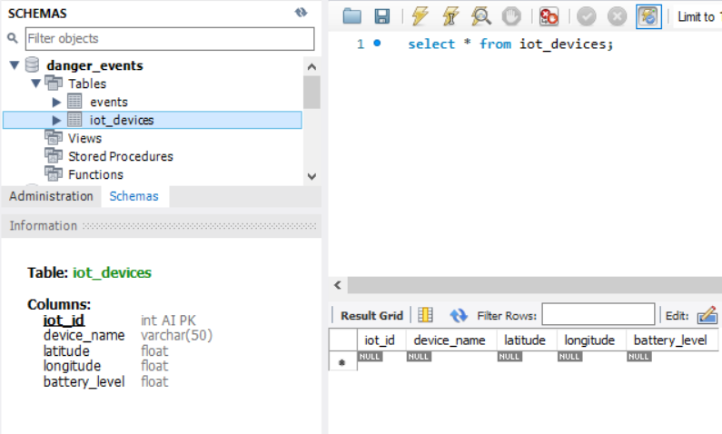

# Τελική Παρουσίαση του Project: Ανάπτυξη Λογισμικού για Δίκτυα και Τηλεπικοινωνίες (Δικτυακός Προγραμματισμός) (Κ23-Β)

*Το project αναπτύχθηκε μέσω GitLab (https://anapgit.scanlab.gr/PetrosKoulouridis/network-programming-project)*

---

Οι φοιτητές (5μελής ομάδα):
- Πέτρος Κουλουρίδης (sdi2000099@di.uoa.gr)
- Θεόδωρος Μωραΐτης (sdi2000150@di.uoa.gr)
- Ιωάννης Ιωάννου (sdi1700215@di.uoa.gr)
- Κωνσταντίνος Ρούσσος (sdi1800166@di.uoa.gr)
- Νικόλαος Κικίδης (sdi1900279@di.uoa.gr)

## 1. Περιγραφή
Η παρούσα εφαρμογή στοχεύει στην παρακολούθηση και διαχείριση περιβαλλοντικών κινδύνων με στόχο την ασφάλεια των πολιτών 
σε καταστάσεις έκτακτης ανάγκης. Το σύστημα αποτελείται από τέσσερα βασικά μέρη:
-  ** Edge Server** [[/edge-server]](edge-server) (Edge Εφαρμογή Management-Database-Frontend): Επεξεργάζεται τα δεδομένα, εντοπίζει συμβάντα κινδύνου, τα καταχωρεί σε βάση δεδομένων, και ενημερώνει τις συσκευές, ενώ ταυτόχρονα παρέχει γραφική απεικόνιση των συσκευών σε χάρτη.
-  ** IoT-App** [[/IoT]](IoT) (Android Eφαρμογή IoT-Sensors): Συλλέγει μετρήσεις από αισθητήρες (καπνού, αερίων, θερμοκρασίας, υπεριώδους ακτινοβολίας) και αποστέλλει δεδομένα μέσω MQTT.
-  ** User-App** [[/android-app]](android-app) (Android Εφαρμογή User-Alerts): Στέλνει το στίγμα θέσης του χρήστη και τον ενημερώνεται σε περίπτωση κινδύνου (μέσω MQTT).
-  ** Mosquitto MQTT Broker** (Αυτόματο Πρόγραμμα Συστήματος): Λειτουργεί ως ο κεντρικός διαμεσολαβητής MQTT μηνυμάτων μεταξύ του Edge Server, της IoT-App και της User-App.

## 2. Τεχνικά Χαρακτηριστικά
### - Edge Server:
*Δεν χρησιμοποιήθηκε κάποιο framework, ούτε για το backend ούτε για το frontend του Edge Server*
- Backend:
  - Java version 17 (JDK 17.0.12)
  - Maven (build management tool) version 3.9.8
  - Eclipse Paho Java MQTT v3 client library
  - MySQL version 8.0.39
- Frontend:
  - JavaScript ES14
  - HTML5
  - CSS3
  - Leaflet.js 1.9.4
  - OpenStreetMap API
- Developed on IntelliJ IDEA version 2024.3.2.2 (Ultimate Edition)
- Used Mosquitto Broker version 2.0.20 (MQTT v5.0/v3.1.1/v3.1 broker)
 
### - IoT & User Android Apps:
- Java version 17 (JDK 17.0.12)
- Gradle (build management tool) version 8.9 - 8.10
- Eclipse Paho Android MQTT v3 service client library
- Developed on Android Studio Ladybug | 2024.2.1 Patch 3
- Compatible with Android API 29 & Android API 30 (Android 10 & Android 11)

## 3 Documentation
Κάθε επιμέρους κομμάτι της εφαρμογής έχει το δικό του documentation που εξηγεί τη λειτουργικότητα και τον κώδικα. Μπορείτε να βρείτε τα αντίστοιχα αρχεία στα παρακάτω links:
- [Edge Server Documentation](edge-server/Report.md) (edge-server/Report.md)
- [IoT App Documentation](IoT/Report.md) (IoT/Report.md)
- [User App Documentation](android-app/Report.md) (android-app/Report.md)


## 4. Παρουσίαση Ολοκληρωμένης Εκτέλεσης του Project
- **Αρχικά σχόλια:**  
1) Το project λειτουργεί σε επίπεδο υποδικτύου, δηλαδή οι Mosquitto MQTT Broker και Edge Server, και τα IoT & User Android Apps πρέπει να είναι συνδεδεμένα όλα στο ίδιο υποδίκτυο (WiFi).
2) Για την ορθή εκτέλεση του Edge Server, το MySQL Workbench (ή ο αντίστοιχος MySQL Server – service `MYSQL80`) πρέπει να τρέχει και να βρίσκεται σε κατάσταση "running", ώστε ο Edge Server να έχει πρόσβαση στη βάση δεδομένων.
3) Για την ορθή εκτέλεση του Edge Server (σχετικά με την πρόσβαση στην MySQL) πρέπει να έχουν δοθεί σωστά τα στοιχεία username και password (mysql) εντός του αρχείου application.properties του edge-server.

---

### Βήμα 1: Εκκίνηση του Mosquitto MQTT Broker εντός υποδικτύου

1. **Δημιουργία Manual Configuration File:**
    - Δημιουργήστε ένα αρχείο `mymosquitto.conf` στο directory του Mosquitto (π.χ. `C:\Program Files\mosquitto\mymosquitto.conf`) με το παρακάτω περιεχόμενο
(οι δυο αυτές παράμετροι επιτρέπουν στον broker να δέχεται συνδέσεις απο ανώνυμους χρήστες, δηλαδή απο οποιονδήποτε εντός υποδικτύου):
      ```
      listener 1883
      allow_anonymous true
      ```
2. **Εκτέλεση του Broker:**
    - Ανοίξτε ένα terminal και εκτελέστε την παρακάτω εντολή ώστε να εκκινηθεί ο mosquitto broker με το custom config file
(η παράμετρος `-v` ενεργοποιεί το verbose mode, παρέχοντας στο terminal πληροφορίες για τις συνδέσεις, αποσυνδέσεις, και τις ανταλλαγές μηνυμάτων):
      ```
      mosquitto -c "C:\Program Files\mosquitto\mymosquitto.conf" -v
      ```
      

---

### Βήμα 2: Εκκίνηση του Edge Server
- Ο Edge Server λαμβάνει δεδομένα από τις android εφαρμογές, επεξεργάζεται τα εισερχόμενα μηνύματα βάσει προκαθορισμένων thresholds, 
και καταχωρεί τα συμβάντα κινδύνου στη MySQL βάση δεδομένων αλλά και σε εσωτερικές δομές δεδομένων για χρήση από το frontend.
Επιπλέον, ενημερώνει τις User συσκευές σε περίπτωση alert(s).

- **Εκτέλεση:**
    - Τρέξτε την εφαρμογή του Edge Server (απο τον ίδιο υπολογιστή με τον Broker) εκτελώντας την main συνάρτηση της 
κλάσης `EdgeServer.java`, που βρίσκεται στο:
      ```
      edge-server/src/main/java/main/EdgeServer.java
      ```
      *Σημείωση: για την ορθή λειτουργία της εφαρμογής όσον αφορά το hosting του frontend page, πρέπει να έχει ανοιχτεί 
ο edge-server (folder-project) μόνος του σε ένα παράθυρο InteliJ IDEA (έτσι ώστε να δουλέψει το path του web folder που 
περιέχει τα files του frontend page)*
    - Κατά την εκκίνησή του, αρχικοποιούνται o HTTP (sub)server, η database, και ο MQTT listener (και άρα γίνεται η σύνδεση με τον Broker), 
και ο Edge Server τίθεται σε κατάσταση αναμονής μέχρις ότου λάβει κάποιο MQTT μύνημα απο IoT ή User app, όπως φαίνεται παρακάτω:
  
    - Εφόσον εκκινηθεί ο Edge Server, αρχικοποιoύνται (σε empty) το schema και τα tables της MySQL database, όπως φαίνεται παρακάτω:
  <p align="center">
    
    
  </p>

---
 
### Βήμα 3: Εκκίνηση των IoT-Apps
- Η εφαρμογή συλλέγει τις μετρήσεις των αισθητήρων (καπνού, αερίων, θερμοκρασίας, υπεριώδους ακτινοβολίας) και αποστέλλει τα δεδομένα στον Edge Server (μέσω του MQTT).

- **Εκτέλεση:**
  - Τρέξτε την εφαρμογή IoT-App σε κάποια φυσική Android συσκευή που είναι συνδεδεμένη στο ίδιο υποδίκτυο (WiFi).
  - To IoT-App μπορεί να τρέξει και σε παραπάνω απο μια Android συσκευές, (ή σε πολλά instances του app εντός της ίδιας συσκευής μέσω parallel space). Αρα, project-wide, υποστηρίζονται πολλαπλά ταυτόχρονα ΙοΤs.
  - Παρακάτω βλέπουμε την εφαρμογή IοΤ-App σε κατάσταση λειτουργίας μέσα από δύο διαφορετικές συσκευές (άρα έχοντας δυο IoTs). Βλέπουμε στο menu activity ότι έχουν δοθεί ορθά στα στοιχεία του MQTT Broker, και να έχει γίνει επιτυχώς το START TRANSMISSION:
    <p align="left">
        
        
    </p>

---

### Βήμα 4: Εκκίνηση των User-Apps
- Η εφαρμογή στέλνει το στίγμα θέσης του χρήστη και λαμβάνει ειδοποιήσεις σε περίπτωση εντοπισμού κινδύνου από τον Edge Server (μέσω του MQTT).

- **Εκτέλεση:**
  - Τρέξτε την εφαρμογή User-App σε κάποια φυσική Android συσκευή που είναι επίσης συνδεδεμένη στο ίδιο υποδίκτυο (WiFi).
  - To User-App μπορεί να τρέξει και σε παραπάνω απο μια Android συσκευές, (ή σε πολλά instances του app εντός της ίδιας συσκευής μέσω parallel space). Αρα, project-wide, υποστηρίζονται πολλαπλοί ταυτόχρονοι Users.
  - Παρακάτω βλέπουμε την εφαρμογή User-App σε κατάσταση λειτουργίας μέσα από δύο διαφορετικές συσκευές (άρα έχοντας δυο users). Βλέπουμε στο menu activity ότι έχουν δοθεί ορθά στα στοιχεία του MQTT Broker, και να έχει γίνει επιτυχώς το START TRANSMISSION:
    <p align="left">
        
        
    </p>

---

### Βήμα 5: Πρόσβαση στο Frontend του Edge Server

- Ανοίξτε έναν web browser (π.χ. Firefox ή Chrome) στον υπολογιστή όπου τρέχει ο Edge Server και μεταβείτε στη διεύθυνση:
```
http://localhost:8080/
```

- Στην ιστοσελίδα αυτή εμφανίζεται το management frontend του Edge Server, όπου μπορείτε να δείτε σε πραγματικό χρόνο έναν χάρτη με τις συνδεδεμένες IoT συσκευές και τους Users.


---

### Βήμα 6: Περίπτωση δημιουργίας κινδύνου-Alert

- Η δημιουργία alert ξεκινάει απο κάποιο IoT στο οποίο ανεβαίνουν οι τιμές των sensors παραπάνω απο τα προκαθορισμένα thresholds.

Για παράδειγμα, ας ανεβάσουμε την τιμή του Gas Sensor του IoT-1 πάνω απο το threshold (το οποίο σημαίνει δημιουργία high alert):
    <p align="left">
        
    </p>

Αφού δημιουργήθηκε high alert, οι User-1 και User-2 λαμβάνουν το αντίστοιχο μήνυμα high-alert στο User-App τους:
    <p align="left">
        
        
    </p>

Παράλληλα βλέπουμε και την κατάσταση του high alert στο frontend page ως ένδειξη εικονιδίου του IoT-1 με κόκκινο χρώμα, αλλά και ως ένδειξη στο aside window:
    <p align="left">
        
    </p>

- Αντίστοιχα, αν ανέβουν και οι τιμές των sensors του ΙοΤ-2 (για παράδειγμα των Temperature & UV για δημιουργία mid alert), 
τότε σε συνδυασμό με το alert απο το IoT-1, έχουμε δυο alerts
και το frontend page ενημερώνεται αντίστοιχα με ενα ορθογώνιο παραλληλόγραμμο με κόκκινη χρωματική ένδειξη, ανάμεσα στα δυο IoTs 
(και τα δυο User-Apps λαμβάνουν πάλι τις αντίστοιχες ειδοποιήσεις):
    <p align="left">
        
    </p>

- Επιπλέον, πάνω στον χάρτη του frontend page, έχουμε την δυνατότητα να πατήσουμε πανω σε κάθε IoT ή User συσκευή και να δούμε μέσω info-window
διάφορες πληροφορίες για κάθε συσκευή, ενημερωμένες σε πραγματικό χρόνο:
    <p align="center">
        
        
    </p>

---
